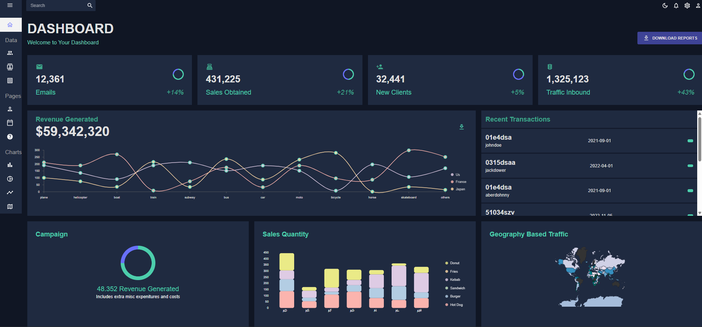
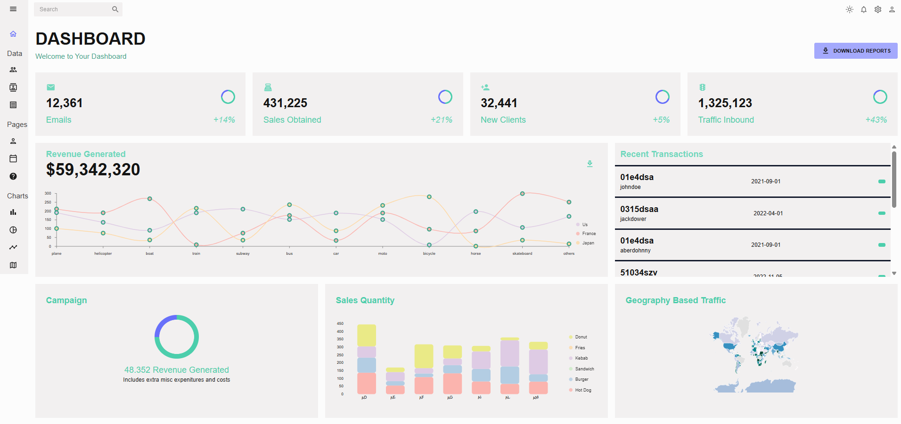
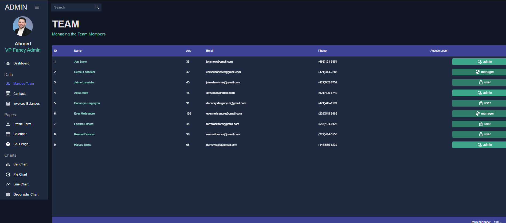
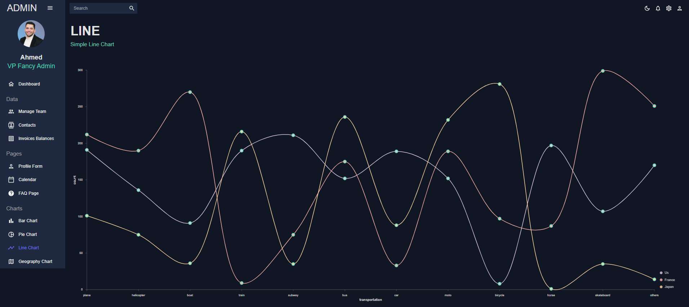
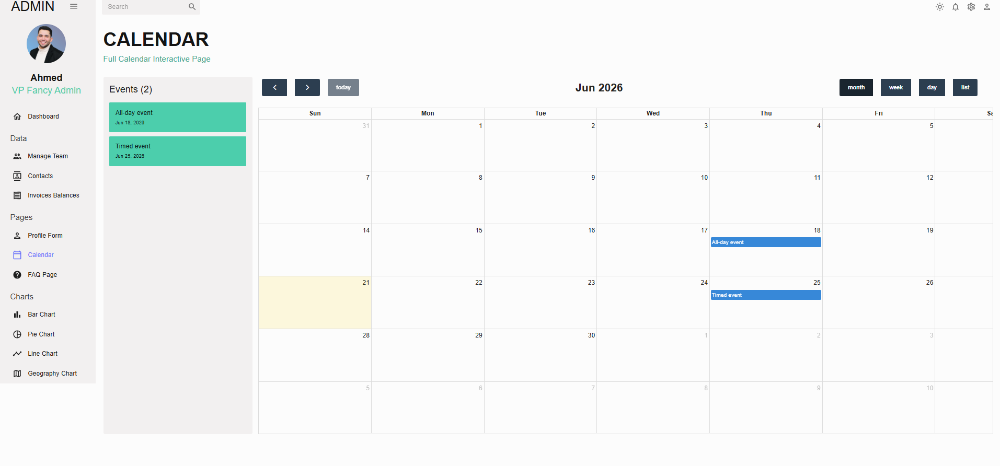

# 📊 Admin Dashboard

A modern, high-performance data visualization and business analytics dashboard built with React. This responsive interface features real-time metric tracking, advanced data visualization tables, global traffic heatmaps, and custom data forms optimized for modern enterprise applications.

## 🚀 Live Demo
[👉 Click here to view the live project](https://admin-dashboard-gray-chi.vercel.app/)

---
<div align="center" style="margin: 25px 0; max-width: 800px; margin-left: auto; margin-right: auto;">

  <!-- Image 1 (Open by default) -->
  <details open style="margin-bottom: 15px; background: rgba(0, 105, 92, 0.05); padding: 12px; border-radius: 12px; border: 1px solid rgba(0, 105, 92, 0.15); text-align: left; direction: ltr;">
    <summary style="font-weight: bold; font-size: 16px; color: #00695c; cursor: pointer; user-select: none;">📸 Main Dashboard View (Click to Collapse)</summary>
    <div align="center">
      
    </div>
  </details>

  <!-- Image 2 -->
  <details style="margin-bottom: 15px; background: rgba(0, 105, 92, 0.05); padding: 12px; border-radius: 12px; border: 1px solid rgba(0, 105, 92, 0.15); text-align: left; direction: ltr;">
    <summary style="font-weight: bold; font-size: 16px; color: #00695c; cursor: pointer; user-select: none;">📸 Arabic Localization View (Click to Open)</summary>
    <div align="center">
      
    </div>
  </details>

  <!-- Image 2 -->
  <details style="margin-bottom: 15px; background: rgba(0, 105, 92, 0.05); padding: 12px; border-radius: 12px; border: 1px solid rgba(0, 105, 92, 0.15); text-align: left; direction: ltr;">
    <summary style="font-weight: bold; font-size: 16px; color: #00695c; cursor: pointer; user-select: none;">📸 Arabic Localization View (Click to Open)</summary>
    <div align="center">
      
    </div>
  </details>

  <!-- Image 2 -->
  <details style="margin-bottom: 15px; background: rgba(0, 105, 92, 0.05); padding: 12px; border-radius: 12px; border: 1px solid rgba(0, 105, 92, 0.15); text-align: left; direction: ltr;">
    <summary style="font-weight: bold; font-size: 16px; color: #00695c; cursor: pointer; user-select: none;">📸 Arabic Localization View (Click to Open)</summary>
    <div align="center">
      
    </div>
  </details>

  <!-- Image 2 -->
  <details style="margin-bottom: 15px; background: rgba(0, 105, 92, 0.05); padding: 12px; border-radius: 12px; border: 1px solid rgba(0, 105, 92, 0.15); text-align: left; direction: ltr;">
    <summary style="font-weight: bold; font-size: 16px; color: #00695c; cursor: pointer; user-select: none;">📸 Arabic Localization View (Click to Open)</summary>
    <div align="center">
      
    </div>
  </details>


</div>
## ✨ Features

* **Actionable KPI Metrics:** Summary cards at the top track total emails sent, sales obtained, new clients, and inbound traffic with percentage growth analytics.
* **Interactive Data Visualization:** 
  * Multi-line revenue progression chart segmented by region (US, France, Japan).
  * Segmented, stacked bar charts tracking sales quantities of specific product segments.
  * Dedicated campaign progress donut chart detailing expenditure allocations.
* **Geographic Insights:** Interactive world map visualizing global user and traffic density across continents.
* **Live Activity Ledger:** Clear, scrolling transaction feed capturing user data, entry timestamps, and monetary statuses.
* **Dynamic Form & Views:** Built-in views for Profile Form creation, structured FAQ dropdowns, interactive Calendars, Team Management logs, and independent full-page chart modules.
* **Unified Theme Architecture:** Fully integrated theme switcher managing color design tokens dynamically for high-contrast visibility.

---

## 🛠️ Built With

* **Core Library:** React.js (Vite Template)
* **Design & UI Components:** Material UI (MUI) / MUI Data Grid / Emotion Styling
* **Data Visualization:** Nivo Charts (Line, Bar, Pie, Geography)
* **State & Theme Control:** React Context API (useMode hook)

---

## 💻 Getting Started

Follow these steps to set up, configure, and run the project locally.

### Prerequisites
Ensure you have **Node.js** (v18 or higher recommended) and **npm** installed.

### Installation

1. **Clone the repository:**
   ```bash
   git clone https://github.com
   ```

2. **Navigate into the project folder:**
   ```bash
   cd your-repo-name
   ```

3. **Install the dependencies:**
   ```bash
   npm install
   ```

4. **Start the local development server:**
   ```bash
   npm run dev
   ```
   *The console will output the local network URL (typically `http://localhost:5173` or `http://localhost:3000`).*

---

## 📂 Project Structure

```text
├── src/
│   ├── Components/         # Reusable UI widgets and standalone charts
│   │   ├── BarChart.jsx
│   │   ├── GeographyChart.jsx
│   │   ├── Header.jsx
│   │   ├── LineChart.jsx
│   │   ├── PieChart.jsx
│   │   ├── ProgressCircle.jsx
│   │   └── StatBox.jsx
│   ├── data/               # Mock data arrays for grid elements and charts
│   │   ├── mockData.jsx
│   │   └── mockGeoFeatures.js
│   ├── scenes/             # Feature-specific page layouts and views
│   │   ├── bar/            # Full-page Bar Chart view
│   │   ├── calendar/       # Interactive event scheduler
│   │   ├── contacts/       # Client contact database layout
│   │   ├── dashboard/      # Main grid overview panel
│   │   ├── faq/            # Accordion-style help center page
│   │   ├── form/           # New user profile registration schema
│   │   ├── geography/      # Comprehensive map analytics layout
│   │   ├── global/         # Shared layouts (Topbar, Sidebar panels)
│   │   ├── invoices/       # Invoicing records and billing grids
│   │   ├── line/           # Full-page Line Chart analytics
│   │   ├── pie/            # Full-page Pie Chart expenditure breakdowns
│   │   └── team/           # Internal member permissions dashboard
│   ├── App.jsx             # App initialization, main routers, and contextual styling
│   ├── index.css           # Global layout resets and custom scrollbars
│   ├── main.jsx            # Application mount point configuration
│   └── theme.jsx           # Dark mode design tokens mapping
├── .gitignore
└── eslint.config.js
```

---

## 📸 Application Preview


---

## 📄 License
This project is open-source and available under the **MIT License**.
